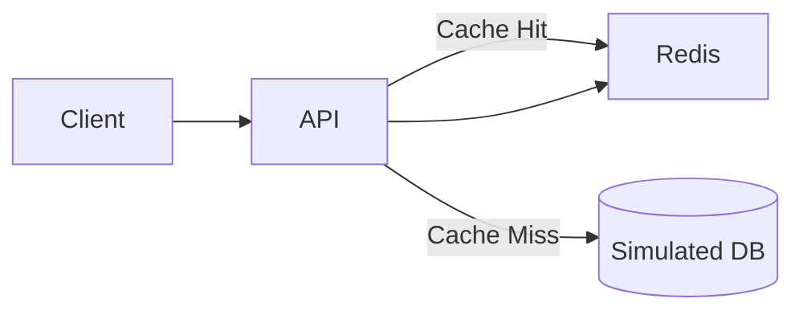

# 🚀 RepairTrack System

API REST para la gestión de reparaciones de dispositivos, evolucionada con una capa de cache utilizando Redis y desplegada mediante Docker Compose.

---

## 📌 Descripción

**RepairTrack** es un sistema backend desarrollado con **FastAPI** que permite consultar información de reparaciones.
En esta versión se implementa una estrategia de **cache con Redis**, mejorando el rendimiento y reduciendo tiempos de respuesta en consultas frecuentes.

---

## 🧱 Tecnologías utilizadas

* 🐍 Python 3.10
* ⚡ FastAPI
* 🟥 Redis
* 🐳 Docker & Docker Compose

---

## 🏗️ Arquitectura



* **Cliente** realiza solicitudes HTTP
* **API (FastAPI)** procesa la lógica
* **Redis** actúa como cache
* **DB simulada** es la fuente principal de datos

---

## ⚡ Implementación de Cache

### Endpoint con cache:

```
GET /repairs/{repair_id}
```

### Estrategia utilizada:

**Cache-Aside**

### Flujo:

* 🔵 **Cache Hit**

  * Redis tiene el dato
  * Se responde directamente desde cache

* 🔴 **Cache Miss**

  * Se consulta la base de datos simulada
  * Se guarda en Redis
  * Se devuelve la respuesta

---

## 🧠 Claves y TTL

* Formato de clave:

```
repair:{repair_id}
```

* TTL:

```
60 segundos
```

---

## 🐳 Ejecución con Docker

### 1. Clonar repositorio

```bash
git clone https://github.com/aperezlux/repairtrack-system.git
cd repairtrack-system
```

---

### 2. Levantar servicios

```bash
docker compose up --build
```

---

### 3. Acceder a la API

```
http://localhost:8000/docs
```

---

## 🧪 Prueba de Cache

Ejecutar:

```
GET /repairs/1
```

### Primera respuesta:

```json
{
  "source": "db"
}
```

### Segunda respuesta:

```json
{
  "source": "cache"
}
```

---

## 📂 Estructura del proyecto

```
repairtrack-system/
│
├── app/
├── docs/
│   ├── architecture.md
│   ├── cache.md
│   ├── system-brief.md
│   └── requirements.md
│
├── docker-compose.yml
├── Dockerfile
├── requirements.txt
└── README.md
```

---

## 📊 Backlog

🔗 https://github.com/users/aperezlux/projects/2/views/1

---

## 🎥 Video demostrativo

🔗 *(Agregar enlace de Google Drive aquí)*

---

## 👨‍💻 Autor

**Angel Rodrigo Perez Lux**

---

## ✅ Estado del proyecto

✔ API funcional
✔ Redis integrado
✔ Cache implementado
✔ Docker Compose configurado

---

## 📌 Notas finales

Este proyecto demuestra la implementación práctica de cache en sistemas backend reales, utilizando Redis para optimizar el rendimiento y reducir carga en la fuente de datos.
