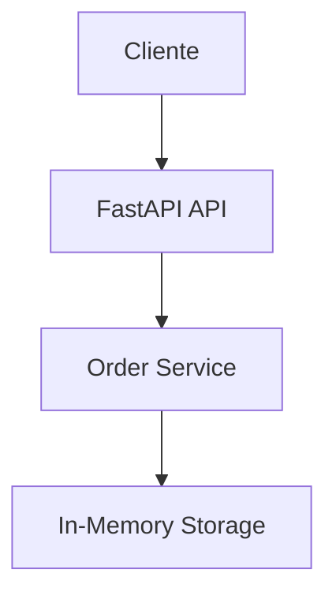

# Arquitectura

## Diagrama

```mermaid
graph TD
A[Cliente] --> B[FastAPI API]
B --> C[Order Service]
C --> D[In-Memory Storage]
```

## Decisión técnica
Se usa almacenamiento en memoria para simplicidad del MVP.
